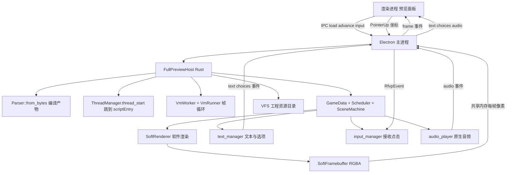

# 全引擎接管预览架构（rfvp full-engine preview）

## 目标

把预览的「画面渲染 + 文本 + 音频 + 输入」全部交给 vendor rfvp 的完整引擎，编辑器渲染进程只做一件事：显示引擎每帧产出的 RGBA 帧，并把点击/键盘事件转发回引擎。

彻底移除当前「编辑器自写投影 + Pixi 自绘」这套晦涩的播放逻辑（[`buildPreviewScript.ts`](../hcb-editor/packages/ui/src/preview/buildPreviewScript.ts:1) 的 prims 投影 + [`PreviewPanel.tsx`](../hcb-editor/packages/ui/src/preview/PreviewPanel.tsx:81) 的 Pixi 绘制）。

## 现状 vs 目标

- 现状：编辑器使用 [`portable`](../hcb-editor/vendor/rfvp/crates/rfvp/src/portable/mod.rs:1) 无头子集（精简 VM + 少量 syscall，只捕获 `draw_solid` 矩形），画面与文本由 TS 投影层自己负责。
- 目标：使用完整引擎栈（[`subsystem`](../hcb-editor/vendor/rfvp/crates/rfvp/src/subsystem/mod.rs:1) + [`vm_worker`](../hcb-editor/vendor/rfvp/crates/rfvp/src/vm_worker/native.rs:52) + [`script`](../hcb-editor/vendor/rfvp/crates/rfvp/src/script/context.rs:29) + [`SoftRenderer`](../hcb-editor/vendor/rfvp/crates/rfvp/src/soft_render/renderer.rs:42)），由引擎自己跑剧情、画画面、放音频、吃输入。

## 可行性关键事实（已核实）

1. 完整引擎的 `Parser::from_bytes`（[`parser.rs`](../hcb-editor/vendor/rfvp/crates/rfvp/src/script/parser.rs:111)）支持从字节 boot，无需文件路径。
2. `ThreadManager::thread_start(0, addr)`（[`thread_manager.rs`](../hcb-editor/vendor/rfvp/crates/rfvp/src/subsystem/resources/thread_manager.rs:121)）可直接把主线程跳到 `scriptEntry`，跳过标题/Logo 启动流程。
3. `soft-render-core` feature（[`Cargo.toml`](../hcb-editor/vendor/rfvp/crates/rfvp/Cargo.toml:186)）是平台无关 CPU 渲染，不含 winit/softbuffer；`SoftRenderer` 输出 `SoftFramebuffer`（`pixels()` + `stride()`），可直接读出 RGBA 帧走 IPC。
4. 完整引擎的 `script::context` 具备完整 `push_stack` 调用者栈帧语义，selset/msgset 不再栈溢出，当前「回退演示引擎」的限制可解除。
5. 无头输入抽象 `RfvpEvent`（[`event.rs`](../hcb-editor/vendor/rfvp/crates/rfvp/src/host_api/event.rs:75)）已存在（PointerUp/PointerDown/KeyDown 等）。
6. 文本由引擎 [`text_manager`](../hcb-editor/vendor/rfvp/crates/rfvp/src/subsystem/resources/text_manager.rs:1) 管理并渲染为 glyph。

## 架构

## 分阶段实施

### Phase 0 — Spike 验证出帧

- [ ] 在 rfvp-cli crate 增加 full-engine 依赖：`soft-render-core` + `no-audio`（先不拉 kira/rodio）。
- [ ] 新建 `FullPreviewHost`：`Parser::from_bytes` boot → `ThreadManager::thread_start(0, scriptEntry)` → `VmWorker::spawn` + `Scheduler` + `SceneMachine` + `SoftRenderer`，复刻 [`SoftHost::step_and_present`](../hcb-editor/vendor/rfvp/crates/rfvp/src/soft_host.rs:280) 的帧循环。
- [ ] 扩展 rfvp-cli 协议：`load` 增加资源目录参数；新增 `frame` 事件（RGBA 像素，先走 base64/二进制通道）。
- [ ] 用 `node-compat-regression` 的 17 类节点跑通出帧，确认 selset/msgset 不再回退、零 VM 错误。

### Phase 1 — 渲染接管

- [ ] Electron 主进程新增 `FullPreviewProcessManager`：起 full-preview 二进制，VFS 指向工程资源目录。
- [ ] 帧经共享内存/IPC 到渲染进程，预览面板改为 canvas 显示引擎帧；删除 Pixi 自绘 prims 路径。
- [ ] 过渡态：文本/选项/音频仍由编辑器现有 UI 驱动（引擎先只负责画面）。

### Phase 2 — 文本/输入/音频接管

- [ ] 引擎 `text_manager` 提取当前文本/选项经协议下发，编辑器文本 UI 改为消费引擎事件。
- [ ] 点击坐标转发为 `RfvpEvent::PointerUp` 到 `input_manager`；音频切到引擎原生播放。
- [ ] 节点定位映射：引擎当前 label / G 状态 → 节点 id（保留编辑器跳转/高亮 UX）。

### Phase 3 — 清理与回归

- [ ] 移除 `buildPreviewScript`/`projection` 的绘制职责；FakeEngine 退化为纯协议回放测试桩。
- [ ] 更新/新增回归：真实引擎出帧 + 17 节点零错误 + selset/msgset 不再回退。
- [ ] 全量 test/typecheck/build/lint + 用户工程验证。

## 协议变更（rfvp-cli stdin/stdout JSON）

- `load`：新增 `projectDir` / 资源根目录字段（VFS 根）。
- 新增事件：
  - `frame`：`{ type: "frame", format: "rgba8", width, height, data }`（Phase 0 先 base64，Phase 1 改共享内存句柄）。
  - `text` / `choices`：引擎 text_manager 状态（Phase 2）。
- 新增请求：`input`：`{ op: "input", event: RfvpEvent }`（Phase 2）。

## 风险与决策点

1. **资源格式**（最大不确定点）：全引擎 graph syscalls 期望从 `graph_bg.bin`/`graph_bs.bin` 归档读图；编辑器当前导入散图。两条路：
   - A. VFS 喂原始游戏资源目录（保真，自定义导入图不显示）。
   - B. VFS 适配层把「资源名 → 已导入图片」映射进引擎纹理路径（自定义图可显示，工作量更大）。
   - 建议 Phase 0 先走 A 验证出帧，Phase 2 再评估 B。
2. **字体**：需初始化 fontface manager（引擎内置字体已随 crate 打包）。
3. **音频后端**：`audio` feature 拉 kira/rodio 较重；Phase 0 用 `no-audio` 过渡，Phase 2 再切原生。
4. **帧传输带宽**：640×480 RGBA ≈ 1.2MB/帧；需要共享内存（Windows `memmap`/命名共享内存）而非 JSON。

## 不在本次范围

- 存档/读档、系统设置、视频播放（wmv/mp4）等完整游戏功能。
- 打包发布（先保证 debug 构建与开发预览链路）。
