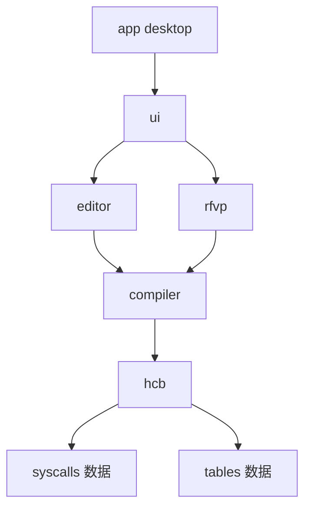

# FVP 剧情编辑器实现计划（hcb-editor）

> 文档状态：Architect 产出，待用户确认后进入 Code 模式实现。
> 目标：面向 FVP 引擎 HCB 脚本的可视化剧情编辑器，**实现 95% 功能**。
> 姊妹文档：编辑器需求边界 / 工作流 / UI 设计见 [`editor-requirements-and-workflow.md`](plans/editor-requirements-and-workflow.md:1)。

---

## 0. 95% 功能的口径界定

本计划以"**模板覆盖度**"为验收口径：

- **95%**：`SPEAK / dia / bsset / bgset / selset / cgset / chaset / msgset / bgm / se / thread / branch / wait / jump` 等高频演出块全部实现为**数据驱动模板**，可被编辑器创建、编辑、编译、反编译、预览。
- **5%**：minigame、复杂 Dissolve/Motion 动画、特殊特效等罕见或未逆向透彻的块，走 **`raw` 逃生舱**（字节透传 + 重定位重算 + 副作用声明），保证"不覆盖也能不破坏"。

判定标准：对参考仓库 [`Sakura.hcb`](.reference_repo/fvpanalysis/hcbtool_test/Sakura.hcb) 与 [`WA_funta.hcb`](.reference_repo/fvpanalysis/hcbtool_test/WA_funta.hcb) 反编译出的功能块，≥95% 能被模板识别并 round-trip（字节级复现），剩余 ≤5% 落入 `raw` 且 round-trip 不破坏。

---

## 1. 参考仓库资产盘点（现状基线）

| 资产 | 路径 | 用途 → 去向 |
|---|---|---|
| 项目规范文档（opcode 0x00–0x27 / HCB 头部 / VM 值模型 / 地址修正 / NLS / BIN/HZC） | [`fvp_analysis项目规范文档.md`](.reference_repo/fvpanalysis/fvp_analysis项目规范文档.md:1) | opcode 表 + 头部 schema + 地址修正规则的**唯一语义基线** |
| Python 核心库（766 行） | [`hcb_ir_core.py`](.reference_repo/fvpanalysis/hcb可逆转换/hcb_ir_core.py:1) | `packages/hcb` 的函数级移植蓝本 |
| HCB → IR / IR → HCB / round-trip 验证 | [`hcb_to_ir.py`](.reference_repo/fvpanalysis/hcb可逆转换/hcb_to_ir.py:1) [`ir_to_hcb.py`](.reference_repo/fvpanalysis/hcb可逆转换/ir_to_hcb.py:1) [`roundtrip_verify.py`](.reference_repo/fvpanalysis/hcb可逆转换/roundtrip_verify.py:1) | CLI 与 golden 验收的冻结基准 |
| 可逆转换设计说明 | [`README.md`](.reference_repo/fvpanalysis/hcb可逆转换/README.md:1) | 数据流、IR 字段、回编译规则的对照依据 |
| syscall 语义数据库（174 条） | [`syscall_spec.json`](.reference_repo/fvpanalysis/syscall语义数据库/syscall_spec.json:1) | `packages/hcb/src/syscalls/` 数据文件 |
| SPEAK 34 份模板逐条分析 | [`SPEAK函数功能块结构分析.md`](.reference_repo/fvpanalysis/hcbtool_test/SPEAK函数功能块结构分析.md:1) | SPEAK 模板槽位**精确来源**（216 字节 / G[227] / G[2001..2011] / G[29,293,294,295]） |
| 12 类典型功能块讲解 | [`Sakura.lua典型功能块讲解.md`](.reference_repo/fvpanalysis/hcbtool_test/Sakura.lua典型功能块讲解.md:1) | 95% 模板清单的枚举依据 |
| 指令块功能对照表 | [`指令与指令块功能对照表.md`](.reference_repo/fvpanalysis/hcb可逆转换/指令与指令块功能对照表.md:1) | 栈机语义 → 功能块映射 |
| 史山编辑器（构造器） | [`hcb_build.py`](.reference_repo/SImple-.hcb-Editor/hcb_build.py:1) | bsset / selset / bgset / cgset / chaset / diaset / msgset / bgm / se 的**字节模式来源**（模板数据化蓝本） |
| 背景表 / 角色表样例 | 同上 `bg_list` / `cha_list` | `tables/backgrounds.json` / `tables/characters.json` 初稿 |
| 官方 HCB → Lua 反编译器 | [`hcb2lua_decompiler`](.reference_repo/rfvp/crates/hcb2lua_decompiler/src/main.rs:1) | opcode / CFG / Lua 输出的 Rust 权威参考（注意其 `opcode.rs` 沿用**旧命名**，见 §12） |
| 官方 Lua → HCB 编译器 | [`lua2hcb_compiler`](.reference_repo/rfvp/crates/lua2hcb_compiler/README.md:1) | 受约束 Lua 编译契约（`global/volatile/Sx/__ret` + YAML syscalls 映射），IR 设计与编译 pass 的第二参考基线 |
| 官方反汇编 / 汇编器 | [`disassembler`](.reference_repo/rfvp/crates/disassembler/src/main.rs:1) [`assembler`](.reference_repo/rfvp/crates/assembler/src/main.rs:1) | HCB 二进制往返的低层参考 |
| rfvp 主引擎 portable 运行时 | [`portable/runtime.rs`](.reference_repo/rfvp/crates/rfvp/src/portable/runtime.rs:1) | `boot_from_hcb_bytes` + `tick` + `render_frame` + `handle_event`：M2 rfvp-cli 的**直接底座**（真实 VM 语义，无需自建） |
| rfvp 主引擎 VM 语义基线 | [`script/opcode.rs`](.reference_repo/rfvp/crates/rfvp/src/script/opcode.rs:1) [`script/inst/*`](.reference_repo/rfvp/crates/rfvp/src/script/inst/) | 每条指令一个文件的权威语义实现；0x25/0x27 命名反置在此被**显式修正** |
| rfvp-rebuilder 资源重建器 | [`rfvp-rebuilder`](.reference_repo/rfvp/crates/rfvp-rebuilder/src/main.rs:1) | HCB + NVSG/OGG/BIN 资源重建（M4 资源视图参考） |

**已补齐**：`rfvp` 源码已 clone 至 [`.reference_repo/rfvp/`](.reference_repo/rfvp/README.md:1)，包含官方工具链与 headless portable 运行时。

**仍需补齐**：

1. 合成 HCB 夹具需用 Python 三件套现场生成并冻结为 golden（**游戏原文件不入库**）。
2. `engine-wrapper` 的 `rfvp-cli` 需基于 `rfvp` portable 模块新写一个薄 CLI（官方未直接提供该协议 CLI）。

---

## 2. 五条维护性原则（所有决策的依据）

1. **领域知识数据化**：opcode 表、syscall 语义、SPEAK/bsset/selset/bgset 模板、G[] 符号表、角色/背景表全部是数据文件；新模板 = 加一条数据 + 一个 golden 测试，不改引擎代码。
2. **纯函数核心，headless 可测**：`hcb` / `compiler` 不 import Electron/React，Node CLI 即可全量测试。
3. **单一事实来源**：工程文件（语义 IR）是源，`.hcb` 是编译产物；时间线是流程图的投影，不存第二份数据。
4. **契约即类型**：IR 文件、rfvp 协议、工程文件全部 zod 定义 + `schemaVersion` + 迁移函数。
5. **依赖单向**：`app → ui → editor → compiler → hcb`，`eslint-plugin-import` 的 `no-restricted-imports` 强制，违者 lint 报错。

---

## 3. 总体架构与单仓结构

### 3.1 目录树

```
hcb-editor/
├─ packages/
│  ├─ hcb/            # 领域层①：HCB 二进制格式 + IR（Python 三件套归宿）
│  │  ├─ src/
│  │  │  ├─ core/         # 解码/编码、opcode 表(数据)、指令流
│  │  │  ├─ decompile/    # HCB → CFG → IR
│  │  │  ├─ ir/           # IR 类型 + zod schema + 版本迁移
│  │  │  ├─ validate/     # 栈平衡、分支边界、重定位完整性
│  │  │  └─ syscalls/     # syscall 语义数据库（syscall_spec.json → .ts 数据）
│  ├─ compiler/       # 领域层②：IR → HCB
│  │  ├─ src/
│  │  │  ├─ passes/       # lower → assemble → layout → relocate → encode
│  │  │  ├─ templates/    # speak/bsset/selset/bgset/dia/cg/... 数据模板
│  │  │  ├─ raw/          # 逃生舱：原始块透传 + 补丁
│  │  │  └─ stringpool/   # 字符串池与 push_string 地址身份
│  ├─ rfvp/           # 适配层：rfvp-cli 子进程协议 + FakeEngine
│  ├─ editor/         # 编辑器状态层：文档模型、命令集、undo/redo（无 React）
│  ├─ ui/             # 展示层：React 流程图/时间线/预览/资源四视图
│  └─ apps/
│     └─ desktop/     # Electron 薄壳
├─ engine-wrapper/    # rfvp-cli Rust 包装源码（仅 CI 编译）
├─ fixtures/          # 合成 HCB 测试夹具（无游戏原文件）
├─ plans/             # 本计划与后续设计文档
└─ pnpm-workspace.yaml
```

### 3.2 依赖单向图



### 3.3 编译管线数据流


工具链：**pnpm + Turborepo + Vitest + strict TS + zod + Immer + fast-check**。包间 API 仅通过 `exports` 暴露。

---

## 4. 领域层：opcode 表 + IR 契约（交付物初稿）

### 4.1 opcode 表 TS 定义（`packages/hcb/src/core/opcodes.ts` 初稿）

以 [`hcb_ir_core.py`](.reference_repo/fvpanalysis/hcb可逆转换/hcb_ir_core.py:130) 的 `OPCODES`、规范文档 §6.3 与 rfvp 主引擎 [`script/opcode.rs`](.reference_repo/rfvp/crates/rfvp/src/script/opcode.rs:1) 三源交叉核对，带类型化操作数与栈效应：

```ts
export type OperandKind =
  | 'null'      // 无操作数
  | 'i8'        // 1 字节有符号
  | 'i16'       // 2 字节（语义常作索引/编号）
  | 'i32'       // 4 字节有符号
  | 'f32'       // 4 字节浮点
  | 'x32'       // 4 字节地址/无符号
  | 'u16'       // 2 字节无符号索引（push_global / pop_global 等）
  | 'i8i8'      // 两个连续 i8（init_stack）
  | 'string';   // u8 len + bytes（含 NUL）

export interface OpcodeSpec {
  mnemonic: string;
  operands: OperandKind;
  /** 栈效应：正=压栈，负=弹栈；syscall/call 的精确值由上下文决定 */
  stackDelta: number;
}

export const OPCODES = {
  0x00: { mnemonic: 'nop',          operands: 'null',  stackDelta: 0 },
  0x01: { mnemonic: 'init_stack',   operands: 'i8i8',  stackDelta: 0 },
  0x02: { mnemonic: 'call',         operands: 'x32',   stackDelta: 0 },
  0x03: { mnemonic: 'syscall',      operands: 'i16',   stackDelta: 0 },
  0x04: { mnemonic: 'ret',          operands: 'null',  stackDelta: 0 },
  0x05: { mnemonic: 'retv',         operands: 'null',  stackDelta: -1 },
  0x06: { mnemonic: 'jmp',          operands: 'x32',   stackDelta: 0 },
  0x07: { mnemonic: 'jz',           operands: 'x32',   stackDelta: -1 },
  0x08: { mnemonic: 'push_nil',     operands: 'null',  stackDelta: 1 },
  0x09: { mnemonic: 'push_true',    operands: 'null',  stackDelta: 1 },
  0x0a: { mnemonic: 'push_i32',     operands: 'i32',   stackDelta: 1 },
  0x0b: { mnemonic: 'push_i16',     operands: 'i16',   stackDelta: 1 },
  0x0c: { mnemonic: 'push_i8',      operands: 'i8',    stackDelta: 1 },
  0x0d: { mnemonic: 'push_f32',     operands: 'f32',   stackDelta: 1 },
  0x0e: { mnemonic: 'push_string',  operands: 'string',stackDelta: 1 },
  0x0f: { mnemonic: 'push_global',  operands: 'u16',   stackDelta: 1 },
  0x10: { mnemonic: 'push_stack',   operands: 'i8',    stackDelta: 1 },
  0x11: { mnemonic: 'push_global_table', operands: 'u16', stackDelta: 0 },
  0x12: { mnemonic: 'push_local_table',  operands: 'i8',  stackDelta: 0 },
  0x13: { mnemonic: 'push_top',     operands: 'null',  stackDelta: 1 },
  0x14: { mnemonic: 'push_return',  operands: 'null',  stackDelta: 1 },
  0x15: { mnemonic: 'pop_global',   operands: 'u16',   stackDelta: -1 },
  0x16: { mnemonic: 'pop_stack',    operands: 'i8',    stackDelta: -1 },
  0x17: { mnemonic: 'pop_global_table', operands: 'u16', stackDelta: -2 },
  0x18: { mnemonic: 'pop_local_table',  operands: 'i8',  stackDelta: -2 },
  0x19: { mnemonic: 'neg',          operands: 'null',  stackDelta: 0 },
  0x1a: { mnemonic: 'add',          operands: 'null',  stackDelta: -1 },
  0x1b: { mnemonic: 'sub',          operands: 'null',  stackDelta: -1 },
  0x1c: { mnemonic: 'mul',          operands: 'null',  stackDelta: -1 },
  0x1d: { mnemonic: 'div',          operands: 'null',  stackDelta: -1 },
  0x1e: { mnemonic: 'mod',          operands: 'null',  stackDelta: -1 },
  0x1f: { mnemonic: 'bit_test',     operands: 'null',  stackDelta: -1 },
  0x20: { mnemonic: 'and',          operands: 'null',  stackDelta: -1 },
  0x21: { mnemonic: 'or',           operands: 'null',  stackDelta: -1 },
  0x22: { mnemonic: 'set_e',        operands: 'null',  stackDelta: -1 },
  0x23: { mnemonic: 'set_ne',       operands: 'null',  stackDelta: -1 },
  0x24: { mnemonic: 'set_g',        operands: 'null',  stackDelta: -1 },
  0x25: { mnemonic: 'set_ge',       operands: 'null',  stackDelta: -1 },
  0x26: { mnemonic: 'set_l',        operands: 'null',  stackDelta: -1 },
  0x27: { mnemonic: 'set_le',       operands: 'null',  stackDelta: -1 },
} as const satisfies Record<number, OpcodeSpec>;
```

> 注：`syscall` 的栈效应按导入表 `arg_count` 动态计算；`call` 按被调函数 `init_stack args` 计算；`init_stack` 分配的 locals 不改变操作数栈语义深度（帧内偏移）。
>
> 关键裁定：`0x25` 在 rfvp 主引擎 [`script/opcode.rs`](.reference_repo/rfvp/crates/rfvp/src/script/opcode.rs:138) 中枚举名仍为 `SetLE`、`0x27` 仍为 `SetGE`，但源码注释与 [`inst/setle.rs`](.reference_repo/rfvp/crates/rfvp/src/script/inst/setle.rs:25) / [`inst/setge.rs`](.reference_repo/rfvp/crates/rfvp/src/script/inst/setge.rs:25) 明确其**真实行为**为 `0x25 = >=`、`0x27 = <=`。本表以修正后的 canonical `set_ge`(0x25) / `set_le`(0x27) 为准；[`hcb2lua_decompiler/src/opcode.rs`](.reference_repo/rfvp/crates/hcb2lua_decompiler/src/opcode.rs:186) 未做该修正，移植时**禁止**照抄其 mnemonic 映射。

### 4.2 IR 类型 + zod schema（`packages/hcb/src/ir/types.ts` 初稿）

语义层可辨识联合，**命名字段、不出现栈编号**。设计关键点：`speak` 节点在**编辑器语义**上代表"一句台词"（名字 + 文本 + 语音），编译时展开为「SPEAK 名栏显示 + dia/TextPrint 文本」两条 HCB 块；`dia` 保留为无名字的旁白/纯文本节点。

```ts
import { z } from 'zod';

// 条件表达式（栈机比较的语义化投影）
const CondExpr = z.discriminatedUnion('op', [
  z.object({ op: z.literal('eq'),  a: z.union([z.number(), z.string()]), b: z.union([z.number(), z.string()]) }),
  z.object({ op: z.literal('ne'),  a: z.union([z.number(), z.string()]), b: z.union([z.number(), z.string()]) }),
  z.object({ op: z.literal('gt'),  a: z.number(), b: z.number() }),
  z.object({ op: z.literal('ge'),  a: z.number(), b: z.number() }),
  z.object({ op: z.literal('lt'),  a: z.number(), b: z.number() }),
  z.object({ op: z.literal('le'),  a: z.number(), b: z.number() }),
  z.object({ op: z.literal('global_eq'), global: z.number(), value: z.number() }), // G[idx] == value
  z.object({ op: z.literal('flag_get'), flag: z.number() }),
]);

const Relocation = z.object({
  kind: z.enum(['call', 'jmp', 'jz', 'thread_start_fn', 'string_ref']),
  offset: z.number(),          // 在 raw 块内的字节偏移
  target: z.string(),          // label / 函数 / 字符串池身份
});

const SideEffect = z.object({
  touchesGlobals: z.array(z.number()),   // 读写的 G[] 索引
  refsStrings: z.array(z.string()),      // 字符串池引用身份
});

export const IrNode = z.discriminatedUnion('kind', [
  z.object({ kind: z.literal('label'), name: z.string() }),
  z.object({
    kind: z.literal('speak'),
    speaker: z.string(),            // 角色名，'？？？' 表示未知说话人
    alias: z.string().optional(),   // 别名/其他名义（索尔->一磨/遠矢）
    text: z.string(),               // 台词文本
    voice: z.number().optional(),   // 语音编号（chaset 第一入参）
  }),
  z.object({ kind: z.literal('dia'), text: z.string() }),   // 旁白/无名字文本
  z.object({
    kind: z.literal('bgset'),
    background: z.string(),
    variant: z.number().optional(), // bg_list 细分编号
    transition: z.enum(['cross', 'fade', 'none']).optional(),
  }),
  z.object({
    kind: z.literal('bsset'),
    character: z.string(),
    pose: z.number(),               // 姿势
    costume: z.number(),            // 服装
    expression: z.number(),         // 表情
    layout: z.number(),             // 构图状态 0/-1/1/2
    position: z.object({ x: z.number(), y: z.number() }),
    layer: z.number(),
  }),
  z.object({
    kind: z.literal('selset'),
    choices: z.array(z.object({ text: z.string(), label: z.string() })),
    resultGlobal: z.number().default(103),   // G[103]=选项结果
  }),
  z.object({
    kind: z.literal('audio'),
    type: z.enum(['bgm', 'voice', 'se']),
    channelOrNum: z.number(),
    loop: z.boolean().optional(),
  }),
  z.object({
    kind: z.literal('branch'),
    cond: CondExpr,
    then: z.string(),               // label 引用
    else: z.string(),               // label 引用
  }),
  z.object({ kind: z.literal('thread'), slot: z.number(), entry: z.string() }),
  z.object({
    kind: z.literal('raw'),          // 逃生舱：模板覆盖不到的 5%
    bytes: z.instanceof(Uint8Array),
    relocations: z.array(Relocation),
    sideEffects: SideEffect,
  }),
  z.object({ kind: z.literal('comment'), text: z.string() }), // 编译时丢弃
]);

export const IrHeader = z.object({
  schemaVersion: z.number(),
  engine: z.literal('fvp'),
  game: z.string(),               // 例如 'sakura'
  nls: z.enum(['sjis', 'gbk', 'utf8']).default('sjis'),
});

export const IrScript = z.object({
  header: IrHeader,
  nodes: z.array(IrNode),
});
```

### 4.3 HCB 头部 schema（`packages/hcb/src/core/header.ts`）

依规范文档 §4，头部结构为 `sys_desc_offset` + 代码区 + 系统描述区（entry_point / 全局计数 / game_mode / title / syscall 导入表）。`title_len`、`push_string len`、syscall `name_len` 一律**含 NUL**。未理解字段（`game_mode_reserved`、`custom_syscall_count`）**原样保留**。

### 4.4 资源表外部化（`packages/hcb/src/tables/*.json`）

| 文件 | 内容 | 来源 |
|---|---|---|
| `globals.json` | G[] 符号表：G[227]=说话人样式、G[103]=选项结果、G[2001..2011]=表情计数、G[29,293,294,295]=SPEAK 尾部状态、G[1827]=文本槽等 | SPEAK 分析 + Sakura.lua |
| `characters.json` | 角色 → SPEAK 函数地址（クロ=0x00000004、ハル=0x000000DC …）+ 别名表 | [`hcb_build.py`](.reference_repo/SImple-.hcb-Editor/hcb_build.py:215) `cha_list` |
| `backgrounds.json` | 背景编号 → 函数地址 | [`hcb_build.py`](.reference_repo/SImple-.hcb-Editor/hcb_build.py:20) `bg_list` |

**换游戏 = 换表文件**，代码零改动。

---

## 5. 编译管线：五段式纯函数 + 模板即数据

### 5.1 五段 pass

```ts
compile(ir: IrScript, ctx: { tables: GameTables; patchBase?: HcbBinary }): HcbBinary
  = encode(relocate(layout(assemble(lower(ir, ctx)))))
```

| pass | 职责 | 失败报告 |
|---|---|---|
| `lower` | IR 节点 → 符号化 AsmBlock（模板实例化 / raw 透传） | 指向 IR 节点 |
| `assemble` | AsmBlock → 扁平指令 + 符号引用（label/函数/字符串身份） | 指向节点 + 符号名 |
| `layout` | 定长、分配地址、字符串池布局、栈平衡校验 | 指向节点 + 字节偏移 |
| `relocate` | 重算 `sys_desc_offset`/`entry_point`/call/jmp/jz/ThreadStart 函数地址 | 指向重定位项 |
| `encode` | 序列化为 HCB 二进制 | 字节级 |

**确定性输出硬约束**：map 按 key 排序、ID 单调计数器、输出无时间戳 → 同 IR 两次编译字节完全相同（可 golden 与 git diff）。

### 5.2 模板引擎

模板 = 数据（`signature` + `slots` + `instantiate`/`emitFunctionDef` 声明），引擎只做"查表 + 调用"：

```ts
export interface Template<N extends IrNode = IrNode> {
  id: string;
  signature: AsmPattern[];        // ① 反编译识别签名
  slots: Record<string, SlotSpec>; // ② 参数槽：命名、类型化
  instantiate(node: N, ctx: TemplateCtx): AsmBlock[];        // ③ 调用点展开规则
  emitFunctionDef?(resource: ResourceEntry, ctx: TemplateCtx): AsmBlock[]; // ④ 函数定义体（新增资源时生成，如新角色 SPEAK 函数）
  test: GoldenTestSpec;            // ⑤ instantiate(decompile(样板)) === 样板（字节级）
}
```

`emitFunctionDef` 支撑原创工程的资源表可编辑：新增角色/背景时，编译器用模板生成对应函数定义体（SPEAK 34 份同构 → 生成第 35 份），详见 [`editor-requirements-and-workflow.md`](plans/editor-requirements-and-workflow.md:1) §5。

### 5.3 SPEAK 模板精确槽位（交付物初稿）

以 [`SPEAK函数功能块结构分析.md`](.reference_repo/fvpanalysis/hcbtool_test/SPEAK函数功能块结构分析.md:1) 34 份函数与 [`hcb_build.py`](.reference_repo/SImple-.hcb-Editor/hcb_build.py:333) `chaset` 为源，SPEAK 模板槽位如下（以 `f_00000004`（クロ）为例，216 字节）：

| 槽位 | HCB 表达 | 语义 |
|---|---|---|
| `styleIndex` | `push_i8 N; pop_global 227` | 硬编码样式编号 1..34（每份模板一个） |
| `styleInit` | `push_global 227; call 0x000019E0` | 文本样式初始化 |
| `emotionCounter` | 读 `G[2001..2011]`（=2000+styleIndex） | 表情计数状态机：`==0/2/4/6 → +1`、`==0/1/4/5 → +2` |
| `isUnknown` | `push_stack -3; push_i8 1; neg; set_e` | 参数 a2 == -1 判断"？？？" |
| `nameDisplay` | `push_string '　 ？？？ 　'` / `push_string '　　{name}　　'` + 别名分支 | 名栏显示文本 |
| `aliasVariant` | `push_stack -3; set_e 10/100` | 索尔类角色的别名（一磨=10、遠矢=100） |
| `tail` | `G[29]=1; a1→G[293]; a3→G[294]; call f_0008D409(style); retv→G[295]` | 立绘显示标志 + 语音 + 返回值 |

**关键设计决策**：编辑器语义节点 `speak { speaker, alias?, text, voice? }` 编译时展开为「`chaset`（SPEAK 名栏 + 语音）→ `diaset`（TextPrint 文本）」两条块，由模板组合器负责。这消除了"名字显示"与"台词文本"两个 HCB 层的语义割裂。

### 5.4 bsset 模板槽位（交付物初稿）

源：[`hcb_build.py`](.reference_repo/SImple-.hcb-Editor/hcb_build.py:262) `bsset`，`function_offset = 0x00043F97`：

| 槽位 | HCB 表达 | 语义 |
|---|---|---|
| `cha/pose/cloth/face` | 4 × `push_i8` | 角色/姿势/服装/表情 |
| `layout` | `push_i8 l`（负值 `push_i8 + neg`） | 构图状态：-1 默认 / 0=L / 1=U / 2=S；-10 清立绘 |
| `loc` | `push_i8 {0|1|2}` | 站位：r=0 / m=1 / l=2 |
| `z` | `push_i16` | Z 顺序 |
| `x / y` | `push_i16`（负值补 `neg`） | 屏幕坐标 |
| `layer` | `push_i8` | 层次 |
| `alpha` | `push_nil × 2` | 透明度（占位，暂不设） |
| `tail` | `call 0x00043F97` | 调用立绘设定函数 |

### 5.5 selset 模板槽位（交付物初稿）

源：[`hcb_build.py`](.reference_repo/SImple-.hcb-Editor/hcb_build.py:93) `selset`：

| 槽位 | HCB 表达 | 语义 |
|---|---|---|
| `start` | `push_string 标题 + nil×3 + call 0x0003836D` | 选项基底文字（4 入参） |
| `option` | `push_string 选项 + nil×2 + call 0x00057F0D` | 每个选项（3 入参） |
| `end` | `call 0x0005800B` | 选项结束标志 |
| `dispatch` | `push_global 103; push_i8 i; set_e; jz next; jump target_i` | 按 G[103] 分发到各分支 label |

与 IR `selset { choices[{text,label}], resultGlobal: 103 }` **精确对应**。

### 5.6 bgset 模板槽位（交付物初稿）

源：[`hcb_build.py`](.reference_repo/SImple-.hcb-Editor/hcb_build.py:378) `bgset`：背景编号 → `bg_list` 查函数地址；8~9 个入参（细分 `variant` 用 `push_i8`，无细分用 `push_i8 1; neg` = -1），尾部固定 `call <bg_fn>` + 转场尾块（`0x0C 00 0B 20 03 ... call 0x0004115A`）。

### 5.7 95% 模板清单与功能块映射

| 模板 id | 语义节点 | 功能块来源 | HCB 关键 syscall/函数 |
|---|---|---|---|
| `fvp.speak` | speak | 状态推进 + 名栏 | chaset + SPEAK 函数族 + TextPrint |
| `fvp.dia` | dia | 文本打印 | TextPrint / TextClear / ThreadNext |
| `fvp.bgset` | bgset | 背景 | bg_list 函数 + 转场尾块 |
| `fvp.bsset` | bsset | 立绘 | f_00043F97 |
| `fvp.selset` | selset | 选项 | f_0003836D / f_00057F0D / f_0005800B + G[103] |
| `fvp.cgset` | (raw 或专用) | CG 图 | f_000373A5 族 + PrimSet* |
| `fvp.msgset` | (raw 或专用) | 对话框位置 | f_000349F2 |
| `fvp.bgm` | audio(bgm) | BGM | AudioLoad / AudioPlay |
| `fvp.se` | audio(se) | 音效 | SoundLoad / SoundPlay |
| `fvp.thread` | thread | 线程启动 | ThreadStart |
| `fvp.wait` | (raw 或专用) | 等待 | ThreadWait / ThreadSleep |
| `fvp.branch` | branch | 条件分支 | 比较块 + jz |

以上覆盖 [`Sakura.lua典型功能块讲解.md`](.reference_repo/fvpanalysis/hcbtool_test/Sakura.lua典型功能块讲解.md:898) 列出的 12 类功能块中的主体，构成 95% 基线。

### 5.8 raw 逃生舱（5%）

`raw` 节点强制声明入口/出口地址、触碰 G[]、字符串引用。编译器对内部做字节透传 + 重定位重算，不解析其内部。反编译遇到无法匹配任何模板签名时，自动降级为 `raw` 并保留原字节，**round-trip 不破坏**。

---

## 6. 编辑器状态层（`packages/editor`）

- `EditorState`：`document: IrScript`（不可变树，唯一事实来源）+ `selection` + `views`（flow/timeline/preview/script）。
- 所有修改走 `applyCommand(state, cmd): { next, patches }`，undo/redo 用 Immer patches，零手写撤销。
- 命令集：`AddSpeakNode / AddBranch / MoveNode / ReconnectBranch / EditSpeakFields / ...` 全为纯函数。
- **流程图是唯一编辑面**；时间线、剧本文本视图都是"沿当前路径线性化"的只读投影。
- 资源管理器（角色/背景/音频三张表）可编辑，新增条目由编译器 `emitFunctionDef` 生成对应函数定义体。
- 增量编译：编辑只 touch 单函数 → 只重编该函数；raw 补丁模式走全量。

> 视图纪律、需求边界、UI 设计原则的完整定义见 [`editor-requirements-and-workflow.md`](plans/editor-requirements-and-workflow.md:1)。

---

## 7. rfvp 集成与协议（交付物初稿）

### 7.1 协议 schema（`packages/rfvp/src/protocol.ts` 初稿）

```ts
import { z } from 'zod';

export const RfvpRequest = z.discriminatedUnion('op', [
  z.object({ op: z.literal('handshake'), protocolVersion: z.number() }),
  z.object({ op: z.literal('load'), hcbPath: z.string() }),
  z.object({ op: z.literal('jump'), label: z.string() }),
  z.object({ op: z.literal('step') }),
  z.object({ op: z.literal('advance') }),      // 推进到下一个文本
  z.object({ op: z.literal('skip') }),         // 快进
  z.object({ op: z.literal('get_g'), index: z.number() }),
  z.object({ op: z.literal('set_g'), index: z.number(), value: z.union([z.number(), z.string(), z.null()]) }),
  z.object({ op: z.literal('dump_prims') }),
  z.object({ op: z.literal('shutdown') }),
]);

export const RfvpEvent = z.discriminatedUnion('type', [
  z.object({ type: z.literal('ready'), protocolVersion: z.number() }),
  z.object({ type: z.literal('text'), slot: z.number(), text: z.string() }),
  z.object({ type: z.literal('waiting_text') }),
  z.object({ type: z.literal('audio'), channel: z.number(), action: z.enum(['load', 'play', 'stop']) }),
  z.object({ type: z.literal('thread'), slot: z.number(), status: z.number() }),
  z.object({ type: z.literal('prims'), prims: z.array(z.object({
    id: z.number(), graphId: z.number(), x: z.number(), y: z.number(),
    z: z.number(), alpha: z.number(), scale: z.number(), rotate: z.number(), blend: z.number(),
  })) }),
  z.object({ type: z.literal('g'), index: z.number(), value: z.unknown() }),
  z.object({ type: z.literal('done') }),
  z.object({ type: z.literal('error'), message: z.string() }),
]);
```

### 7.2 组件

- `FakeEngine`：协议的内存实现（伪脚本状态机），UI 组件测试 / Storybook / Playwright 全用它，不依赖真二进制。
- `rfvp-cli`：基于 rfvp 主引擎 [`portable/runtime.rs`](.reference_repo/rfvp/crates/rfvp/src/portable/runtime.rs:28) 的 `PortableRuntime`（`boot_from_hcb_bytes` + `tick` + `handle_event`）封装的薄 CLI，实现本协议并输出 Event 流；`engine-wrapper` 仅 CI 编译该 Rust 包装。
- Electron 主进程仅一个 `RfvpProcessManager`：spawn 预编译 CLI、握手校验 `protocolVersion`、崩溃自动重启、退出清理。
- 预览视图（Pixi.js）自绘 prim（z 序 / alpha / 旋转 / 缩放与 prim 语义一一对应）+ 调试层（G[] 面板 / label 断点 / 点击推进 / ControlPulse 跳过）。
- 测试录真实会话 Event 流，回放给 FakeEngine 做回归。

---

## 8. 测试矩阵

| 层 | 测什么 | 手段 |
|---|---|---|
| hcb/core | 编解码 round-trip、随机指令 property test | Vitest + fast-check |
| hcb/decompile | CFG 构建、功能块识别（对照表每一类） | golden + 合成夹具 |
| hcb/validate | 栈平衡接受/拒绝、越界跳转 | 单元 |
| compiler | 模板 round-trip（字节级）、重定位、raw 边界保持 | golden |
| rfvp | 客户端 vs FakeEngine 全消息流 | 单元 + 回放 |
| editor | 每个命令 apply/undo/redo | 纯函数单测 |
| ui | 组件 + 端到端（假引擎驱动） | Storybook + Playwright |
| 集成 | 合成工程 IR → 编译 → 假引擎跑通 | CI 每日 |

纪律：**CI 只跑合成夹具，游戏原文件不进仓库**；**golden 文件进版本库**，编译输出变化变成可 review 的 diff。

---

## 9. Python → TS 移植对照（函数级）

| 原 Python | TS 归宿 | 说明 |
|---|---|---|
| [`hcb_ir_core.py`](.reference_repo/fvpanalysis/hcb可逆转换/hcb_ir_core.py:1) `OPCODES` / 读写原语 | `hcb/src/core/opcodes.ts` / `binary.ts` | opcode 表带类型化；`u8/i8/u16/i16/u32/i32/f32` 读写原语 |
| `decode_cstring/encode_cstring/raw_or_encoded` | `hcb/src/core/nls.ts` | NLS 三枚举 + 原字节保留 |
| `hcb_to_ir.py` 函数切分/CFG/栈深度 | `hcb/src/decompile/` | CFG 构建、功能块识别 |
| `ir_to_hcb.py` 回编译 + 地址重定位 | `compiler/src/passes/` | 五段 pass |
| [`hcb_build.py`](.reference_repo/SImple-.hcb-Editor/hcb_build.py:1) `bsset/selset/bgset/cgset/chaset/diaset/msgset` | `compiler/src/templates/` | 改造为数据驱动模板 |
| `syscall_spec.json` | `hcb/src/syscalls/` | JSON → TS 数据 + zod 校验 |

**Rust 工具链作为语义基线（优先级高于 Python）**：

| Rust 参考 | 对应 TS | 用途 |
|---|---|---|
| [`hcb2lua_decompiler/src/opcode.rs`](.reference_repo/rfvp/crates/hcb2lua_decompiler/src/opcode.rs:1) | `hcb/src/core/opcodes.ts` | opcode 枚举 + mnemonic（注意 0x25/0x27 旧命名陷阱） |
| [`hcb2lua_decompiler/src/parser.rs`](.reference_repo/rfvp/crates/hcb2lua_decompiler/src/parser.rs:1) | `hcb/src/core/` | HCB 头部 / 指令流解析 |
| [`hcb2lua_decompiler/src/cfg.rs`](.reference_repo/rfvp/crates/hcb2lua_decompiler/src/cfg.rs:1) + `analysis.rs` | `hcb/src/decompile/` | CFG 与功能块识别 |
| [`lua2hcb_compiler/src/compile.rs`](.reference_repo/rfvp/crates/lua2hcb_compiler/src/compile.rs:1) | `compiler/src/passes/` | 汇编 / 布局 / 重定位策略 |
| rfvp 主引擎 [`script/inst/*.rs`](.reference_repo/rfvp/crates/rfvp/src/script/inst/) | `hcb/src/validate/` | 每条指令的精确栈效应与语义 |

**移植验收**：三层交叉——先冻结 Python 当前输出为 golden，TS 逐函数移植到 100% 复现；同时以 Rust `hcb2lua` / `lua2hcb` 输出为第二 golden；rfvp 主引擎 `inst/*` 为语义终裁。

---

## 10. M1–M4 里程碑路线图

### M1（无 GUI）— 领域层 + headless CLI
- **任务**：
  1. 建 monorepo（pnpm-workspace / Turborepo / strict tsconfig / eslint 依赖方向规则）。
  2. 移植 `hcb`：opcode 表、二进制读写、NLS、头部解析、指令流、CFG、IR。
  3. 移植 `compiler`：五段 pass、地址重定位、字符串池。
  4. 移植并数据化四大模板（SPEAK/bsset/selset/bgset）。
  5. 冻结 Python golden → TS 复现验证。
  6. 交付 CLI：`hcb-editor decompile / compile / roundtrip`。
- **验收**：合成 HCB round-trip 字节级一致；≥95% 功能块被模板识别。

### M2 — rfvp 协议 + 假引擎 + Electron 薄壳 + 预览面板
- **任务**：协议 zod schema、基于 `rfvp` portable 模块封装 `rfvp-cli`、FakeEngine、RfvpProcessManager、自绘 prim 预览、G[] 面板、label 跳转。
- **验收**：FakeEngine 驱动预览面板；真实 Event 流回放通过；`rfvp-cli` 用真实引擎跑通合成 HCB。

### M3 — 流程图编辑 + 命令集 + undo/redo + 增量编译 + 资源管理器
- **任务**：React Flow 编辑面、命令集、Immer patches undo、增量编译、资源管理器（可编辑三张表）、新建工程向导（选底座游戏）、模板 `emitFunctionDef` 落地。
- **验收**：所有命令 apply/undo/redo 单测通过；编辑后热重载；新增角色可生成 SPEAK 函数定义体并通过编译。

### M4 — 时间线/剧本文本投影、raw 只读占位、版本迁移
- **任务**：时间线只读投影、剧本文本视图（只读投影，点击定位回流程图）、raw 只读占位块渲染、raw 补丁、IR schemaVersion 迁移。
- **验收**：合成工程 IR → 编译 → 假引擎跑通全剧情；剧本文本视图与流程图双向定位一致。

---

## 11. 验收标准汇总（95%）

1. 领域包离开 Electron 可独立跑全部测试。
2. 模板与资源表加数据不加代码。
3. 所有跨层边界有版本化 schema 兜底。
4. 合成夹具 round-trip 字节级一致。
5. Sakura/WA_funta 反编译功能块模板命中率 ≥95%，余量走 raw 且不破坏。
6. 同 IR 两次编译字节相同（确定性）。

---

## 12. 风险与开放问题

1. **`set_ge/set_le` 命名反置陷阱（已确认，务必遵守）**：rfvp 主引擎已修正（0x25=set_ge=≥、0x27=set_le=≤，见 [`script/opcode.rs`](.reference_repo/rfvp/crates/rfvp/src/script/opcode.rs:138) 注释），但 `hcb2lua_decompiler`/`lua2hcb_compiler` 工具链**仍沿用旧命名**。TS 移植以主引擎为准，兼容层保留 `setle`/`setge` 旧别名，但 canonical mnemonic 与 IR 语义只能用修正后的。
2. **官方工具链与自研 TS 的关系**：官方已有 `hcb2lua`/`lua2hcb`，本项目的 TS 移植价值在于"数据驱动模板 + 语义 IR + 编辑器集成"；M1 需明确不重复造轮子，凡能对齐官方 Rust 输出的地方以官方输出为 golden。
3. **`push_global/pop_global` 操作数宽度**：规范文档标 `i16`，`hcb_ir_core.py` 实为 `u16`，以代码为准，实现期补一条 golden 锁定。
4. **SPEAK 参数 a1/a3 语义**：a1→G[293]、a3→G[294] 已确认写入，但"名字 vs 语音"的精确归属需以 `chaset` 的入参顺序复核（见 §5.3 决策）。
5. **ThreadStart 函数地址重定位**：`push_i32` 后接 `syscall ThreadStart` 的立即数必须参与重定位，移植时必须保留 `address_role` 标记。
